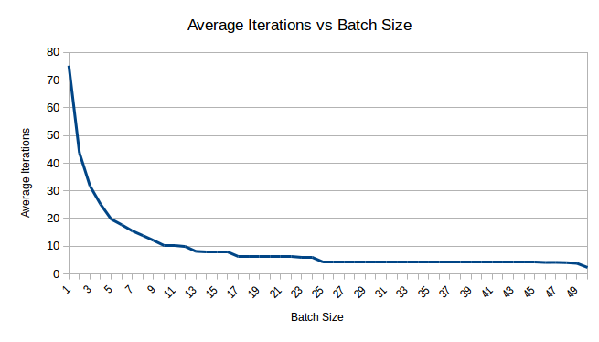

# Markovian Decision Processes

Download report [here](results/report.pdf)

In this repo, algorithms for finding an optimal policy for a given MDP are implemented. The first part is to apply Linear Programming (LP) formulation and the second part is to implement three different variants of Policy Iteration (PI) viz. Howard's PI, Mansour and Singh's Randomised PI, and Batch-switching PI. Thereafter, the efficiency of these variants of PI are compared by running a set of experiments.

### Data

`data` directory provides a few samples of input and output that you can use to test your code. The directory contains three MDPs encoded as text files, with each file in the following format.

```
Number of states
Number of actions
Reward function
Transition function
Discount factor
```

In these files, the number of states `S` will be an integer greater than 0 and less than 100. Assume that the states are numbered `0, 1, 2, … , (S - 1)`. **This project contains MDPs that have exactly two actions**, which are numbered 0 and 1. Thus, the number of actions `A` is 2. The reward function is provided over `S` x `A` lines, each line containing `S` entries. Each entry corresponds to `R(s, a, s')`, wherein state `s`, action `a`, and state `s'` are being iterated in sequence from `0` to `(S - 1)`, `0` to `(A - 1)`, and `0` to `(S - 1)`, respectively. A similar scheme is adopted for the transition function `T`. Each reward lies between -1 and 1 (both included). The discount factor is a real number between 0 (included) and 1 (excluded).

Below is a snippet of python code that is used to generate MDP files.

```
print S
print A

for s in range(0, S):
    for a in range(0, A):
        for sPrime in range(0, S):
            print str(R[s][a][sPrime]) + "\t",

        print "\n",

for s in range(0, S):
    for a in range(0, A):
        for sPrime in range(0, S):
            print str(T[s][a][sPrime]) + "\t",

        print "\n",

print gamma
```

### Instructions

Given an MDP, the program computes the optimal value function `V*` and an optimal policy `π*` by applying the algorithm that is specified through the command line. A shell script called `planner.sh` is used to invoke the program. The arguments to `planner.sh` are

- `--mdp` followed by a full path to input the MDP file,
- `--algorithm` followed by one of lp, hpi, rpi, and bspi,
- `--batchsize` followed by an integer in {1, 2, …, S}, and
- `--randomseed` followed by an integer.

The location of the MDP file is read from the full path that will be provided. The batch size is only relevant for Batch-switching PI, and the random seed only relevant for Randomised PI.

Here are a few examples of how planner might be invoked (it should be invoked from its own directory).

- `./planner.sh --mdp /home/user/mdpfiles/mdp-5.txt --algorithm hpi`
- `./planner.sh --mdp /home/user/temp/data/mdp-7.txt --algorithm bspi --batchsize 8`
- `./planner.sh --mdp /home/user/temp/data/mdp-7.txt --algorithm rpi --randomseed 89`
- `./planner.sh --mdp /home/user/temp/data/mdp-7.txt --algorithm lp --randomseed 89`

In the last example, the random seed is irrelevant, and so the program simply ignores it.

The planner is implemented in `python 2`.

**Note:** For all variants of PI, initial policy is the one that takes the 0 action from every state.

### Output Format

The output of your planner is generated in the following format, and written to standard output.

```
V*(0)   π*(0)
V*(1)   π*(1)
.
.
.
V*(S - 1)   π*(S - 1)
```

In the `data` directory provided, three output files corresponding to the MDP files are provided, which have solutions in the format above.


### Project​ ​Structure

```
153079011/
|--> ​data/				original​ MDP ​files ​and​ ​solutions
|--> ​generated/ 		contains​ ​generated ​MDP ​Files
|--> ​results/ 			results ​from​ ​the​ ​trials ​on​ ​generated ​files
|--> ​generate.py 		script ​to​ ​generate ​new ​MDP​ ​instances
|--> ​get_results.sh 	script ​to​ ​perform​ ​trials ​of​ ​different​ ​algorithms
|--> ​planner.py 		implementation ​of​ ​required ​algorithms
|--> ​planner.sh
```


### Comparison

100 ​sample ​MDPs​ ​with ​50​ ​states​ ​and​ ​2​ ​actions ​were​ ​generated ​by​ ​using​ ​logic in [next](#generation-of-new-mdp-example-files)​ ​section and each ​algorithm ​was applied ​for ​each​ ​MDP ​and ​the​ ​number​ ​of​ ​iterations​ ​observed​ ​were ​averaged for ​each ​algorithms​ ​across ​all​ ​the ​MDPs.​ ​Following ​are​ ​the​ ​results ​observed:

Algorithm | Average ​Iterations | Max | Min
----------|--------------------|-----|-----
Howard’s ​PI | 2.31 | 3 | 2
Randomised ​PI (trial ​0) | 4.68 | 7 | 3
Randomised ​PI ​(trial ​1) | 6.73 | 9 | 3
Randomised ​PI ​(trial ​2) | 4.76 | 8 | 2
Batch ​Switching​ ​PI​ ​(batch ​size ​50) | 2.31 | 3 | 2
Batch ​Switching​ ​PI​ ​(batch ​size ​40) | 4.17 | 6 | 4
Batch ​Switching​ ​PI​ ​(batch ​size ​30) | 4.19 | 5 | 4
Batch ​Switching​ ​PI​ ​(batch ​size ​25) | 4.2 | 5 | 4
Batch ​Switching​ ​PI​ ​(batch ​size ​20) | 6.2 | 7 | 6
Batch ​Switching​ ​PI​ ​(batch ​size ​15) | 8.06 | 10 | 7
Batch ​Switching​ ​PI​ ​(batch ​size ​10) | 10.09 | 11 | 10
Batch ​Switching​ ​PI​ ​(batch ​size ​5) | 19.78 | 21 | 18
Batch ​Switching​ ​PI​ ​(batch ​size ​1) | 75.26 | 83 | 68

Howard’s ​policy ​iteration ​takes ​least​ ​number ​of​ ​iterations​ ​2.31​ ​on​ ​average.​ ​This​ ​is​ ​same as ​running ​a ​Batch​ ​switching​ ​PI​ ​with ​a ​batch​ ​size​ ​of​ ​50,​ ​which​ ​asserts​ ​that​ ​its ​implementation​ ​is correct. ​However, ​this ​number ​increases ​as​ ​the ​batch​ ​size​ ​decreases.​ ​More​ ​trials ​were​ ​done​ ​to​ ​get an ​idea ​of ​this ​trend.

Randomised ​policy ​iteration​ ​is ​taking ​4.68​ ​iterations​ ​on​ ​an​ ​average. ​However,​ ​this average ​can ​change ​for​ ​different​ ​trials. ​The​ ​maximum ​of ​7​ ​iterations​ ​and​ ​minimum​ ​3​ ​iterations were ​required​ ​to ​solve ​MDPs​ ​in​ ​the ​​generated ​folder ​using​ ​this ​algorithm. Effect​ ​of ​batch ​size ​was​ ​observed​ ​by​ ​running​ ​BSPI ​on​ ​each​ ​MDP​ ​with ​batch​ ​size ​varying from ​1 ​to ​50​ ​in ​steps ​of ​1​ ​and ​the​ ​number ​of ​iterations​ ​was​ ​averaged​ ​over​ ​all​ ​the​ ​MDPs​ ​for​ ​each batch ​size ​used.​ ​These ​results​ ​can ​be​ ​found​ ​in ​`​results/batchsize.csv` ​where ​each ​row represents ​a​ ​MDP ​file​ ​and ​each​ ​column ​represents ​the​ ​number ​of​ ​iterations.
Following ​is ​a​ ​graph ​of​ ​results:




### Observations

- Howard’s PI​ ​always takes​ ​at most​ ​3​ ​iterations​ ​for​ ​2​ ​action MDP​ ​problem.​ ​Here,​ ​minimum of 2​ ​iterations were required.
- Average iterations for​ ​Randomised​ ​PI were observed​ ​to​ ​be 4.68​ ​in​ ​first​ ​trial 6.73​ ​in second​ ​and 4.76 in third. Thus, it can​ ​be seen​ ​that​ ​the​ ​maximum​ ​and​ ​minimum​ ​number​ ​of iterations required in these​ ​cases is​ ​also different​ ​for​ ​the same​ ​MDP problems.​ ​This​ ​is due to​ ​the random​ ​seed for​ ​each​ ​application​ ​of the​ ​algorithm​ ​through​ ​​`get_results.sh`
- For Batch Switching​ ​PI, ​ ​it​ ​can be​ ​observed from the​ ​above​ ​graph​ ​that​ ​with​ ​lowest possible batch​ ​size​ ​it takes 75.26 iterations​ ​to​ ​solve​ ​a​ ​50​ ​state​ ​2​ ​action​ ​MDP.​ ​This​ ​number then drops quickly as​ ​batch​ ​size​ ​is increased​ ​and​ ​reaches below​ ​10​ ​for​ ​batch size 13​ ​and more. The​ ​rate​ ​of decrease​ ​then​ ​does​ ​not change​ ​as much.​ ​On further increment​ ​in​ ​batch size by 37, minimum is reached​ ​at​ ​2.31 iterations when​ ​batch​ ​size​ ​is 50.​ ​This trend​ ​in agreement figure 2(b) of​ ​[[​2](#references)].


### Generation​ ​of​ ​new MDP​ ​example files

- `generate.py` ​script ​is ​used ​to ​generate ​new ​randomised​ ​instances ​of​ ​MDP. ​Each​ ​such file ​generated​ ​is ​placed​ ​in `​​generated/` ​directory
- Number ​of ​states ​and​ ​number​ ​of​ ​files ​to​ ​be​ ​generated​ ​is​ ​specified​ ​near​ ​the​ ​topmost​ ​part 
- Following ​are ​the ​requirements ​for ​an ​MDP​ ​to ​be​ ​valid
    + There ​must ​be ​at​ ​least ​one​ ​transition​ ​from ​each​ ​state
    + Sum ​of ​transition ​matrix ​entries ​(between ​0​ ​and​ ​1)​ ​from ​a​ ​state​ ​and ​a​ ​particular should ​be ​1
    + Rewards ​can ​be ​negative​ ​as​ ​well​ ​as ​positive
-  From ​line​ ​44​ ​onwards,​ ​first ​a ​different​ ​random ​seed​ ​is​ ​generated​ ​for​ ​each ​file​ ​to​ ​be generated. ​Then ​the ​transition ​and ​reward ​function​ ​arrays​ ​of​ ​appropriate​ ​sizes​ ​are initialized ​with​ ​all​ ​zeros.
- For ​each ​initial ​state ​and ​each​ ​action, ​a​ ​sequence​ ​of​ ​0s ​and​ ​1s​ ​is ​generated​ ​such​ ​that​ ​it​ ​has at ​least ​one ​entry ​as ​1 ​and ​length​ ​of​ ​this ​sequence​ ​is ​equal​ ​to​ ​number​ ​of ​states. ​This​ ​is done ​to ​ensure​ ​that ​there​ ​is​ ​at ​least​ ​one​ ​transition​ ​from​ ​each​ ​state.
- For ​obtaining ​valid ​transitions​ ​for ​given​ ​state​ ​and​ ​action,​ ​a​ ​random ​vector​ ​of ​length​ ​equal to​ ​total ​states​ ​is ​generated​ ​such​ ​that ​each​ ​entry​ ​is ​between​ ​0​ ​and ​1.​ ​This​ ​vector​ ​is ​then element ​wise​ ​multiplied ​with​ ​the ​sequence​ ​of​ ​0s​ ​and ​1s​ ​generated ​from​ ​previous​ ​step, ​to ensure ​that​ ​there ​are ​some ​non ​reachable​ ​states.​ ​Then,​ ​this ​vector​ ​is​ ​divided​ ​by​ ​its​ ​sum ​to make ​the ​sum ​of ​all​ ​elements​ ​equal​ ​to​ ​1.
- For ​each ​state​ ​and ​action ​pair,​ ​rewards ​are​ ​generated​ ​by​ ​subtracting ​1​ ​from​ ​each​ ​value ​of a ​random ​vector​ ​whose ​entries ​lie ​between ​0​ ​and​ ​2.​ ​This​ ​is​ ​multiplied​ ​by​ ​the​ ​sequence​ ​of 1s ​and​ ​0s ​to ​ensure ​there ​are​ ​no​ ​rewards​ ​for ​non​ ​reachable​ ​states.
- From ​line​ ​11​ ​to ​44 ​is ​the​ ​function ​to​ ​write​ ​the​ ​file​ ​according​ ​to​ ​arrays ​generated.
- Gamma ​was​ ​generated​ ​as​ ​a ​random ​sample​ ​from ​uniform​ ​distribution​ ​between​ ​0​ ​and​ ​1 and ​written​ ​upto ​2 ​digits ​in​ ​MDP​ ​file.

*Snippets ​from​ `​​_randDense` ​function​ ​of ​MDP​ ​Toolbox ​documentation​ ​was​ ​used​ ​for above ​implementation*​[[1](#references)]


### References

1. [MDP Toolbox​ ​Documentation](http://pymdptoolbox.readthedocs.io/en/latest/_modules/mdptoolbox/example.html#rand)
2. Batch-Switching Policy Iteration, Shivaram Kalyanakrishnan,​ ​Utkarsh​ ​Mall, and​ ​Ritish Goyal, IJCAI​ ​2016, pp. 3147-3153