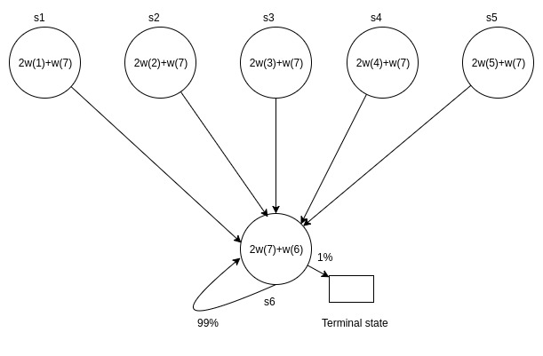
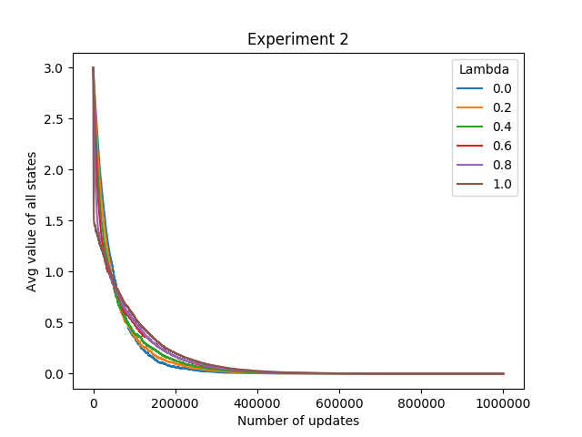

# Baird's Counterexample

Download report [here](report/report.pdf)

This section describes implementation of on-line TD algorithms with linear function approximation. It highlights the issues arising in online algorithms used in conjunction with function approximation.

### MDP

The MDP shown in the figure consists of 6 non-terminal states and 1 terminal state. It is an episodic MDP. Episodes start in one of the five upper states (picked uniformly at random), and proceed immediately to the lower state. When the agent takes (the only available) action in the lower state, it remains in the same state with probability 99%; with probability 1% it goes to the terminal state (and the episode ends). Take the discount factor γ to be 0.99. All rewards are zero rewards. By default the value of the terminal state is also taken to be zero.

### Task

The goal here is to perform policy evaluation: that is, to estimate the value function of the policy being followed. The value of each state is to be **approximated** as a linear combination of features. The parameters to be learned are coefficients `w(1)` through `w(7)`. The actual approximations for each state are shown in the figure: for example, `V(s2) ≈ 2 w2 + w7`. It is easy to see that there exist several configurations of the weights that give the exact value function, which is uniformly zero. This section tests two different TD variants for convergence to the zero value function, and so the following two experiments are considered. Assume that a total of `N` updates are performed.

1. Repeat `N` times: A non-terminal state `s` is picked in a round-robin manner, and the next state `s'` is picked according to the dynamics of the MDP: if `s` is among the upper states, `s'` is `s6`; if `s` is `s6`, then `s'` is `s6` with probability 99%, and the terminal state with probability 1%. The value function is updated based on a TD(0)-type update (Section 8.2, Sutton and Barto (1998)). Thehe learning rate `α` is fixed to be a constant 0.001.

2. Implement episodic TD(λ) (Section 8.2, Sutton and Barto (1998)): that is, each episode is started in one of `s1 – s5` (picked uniformly at random), and the dynamics of the MDP are followed until the episode ends (each episode is likely to last about a 100 steps on account of the self-transitions in `s6`). A TD(λ) update is made after each transition (with `α` as above). The experiment is stopped after `N` (`N` will be much larger than the average episodic length, and so multiple episodes are simulated).

### Results

1. The figure below shows the results of experiment one. It can be seen that the value function does not converge at all.

	

	This is because, in this experiment, updates are being done differently than what original MDP trajectory suggests [1]. The updates are off policy and each state is getting updated uniformly. In this experiment, states are not being backed up with same distribution as it would have been if the same experiment is repeated for more number of steps per episode. This difference between the estimation distribution and the distribution due to original policy to be evaluated along with the function approximation is leading to divergence. However, this divergence is only for some choices of initial weights (eg. all 1s). There may or may not be other choices of weights for which same approach converges [2].

2. The figure shows the result of experiment 2 . Since all the weights are initialized with all 1s, the initial value function for all states is 3. As lambda is varies from 0 to 1, the values start decreasing towards 0. Initially higher lambda leads to faster decrease in values. But, after a while trend reverses and the lowest lambda has highest rate of decrease.

	

	This trend is observed because, each lambda from 0 to 1 gives longer lasting traces of previous values as the lambda increases. Effectively lambda 1 means all the values encountered from beginning have some contribution to the current update. So, initially lambda approaches true value of 0 quickly as every update encountered so far has a contribution to next update. But, lambda 0 update has contribution from only the previous update.

	After sufficient number of updates, and when the estimates are fairly correct, the same longer lasting traces lead to slower decrease in the value function. Initially the value of each state is 3. So, it takes more number of updates for value to reach zero when lambda is 1 than if lambda is a lower value like 0.6 as lambda 0.6 means that initial value of 3 has less contribution to current update than lambda 1 case and hence quickly approaches zero.

3. The following table shows the results of trials with different initial weights.

	- A

		| Initial Weights | 1 | 1 | 1 | 1 | 1 | 1 | 1 |
		| Final Value | -0.000017 | -0.000021 | 0.000017 | 0.000015 | 0.000010 | -0.000001 |  |
		| Final Weights | 0.279992 | 0.279990 | 0.280008 | 0.280008 | 0.280005 | 1.119999 | -0.560000 |

	- B

		| Initial Weights | 1 | 2 | 3 | 4 | 5 | 6 | 7 |
		| Final Value | -0.001138 | -0.000868 | -0.000158 | 0.001065 | 0.001693 | -0.000006 |  |
		| Final Weights | 0.999420 | 0.999555 | 0.999910 | 1.000522 | 1.000835 | 3.999950 | -1.999978 |

	- C

		| Initial Weights | 1 | 6 | 2 | 9 | 10 | 0 | 5 |
		| Final Value | -0.002300 | 0.000700 | -0.002583 | 0.001684 | 0.002558 | 0.000058 |  |
		| Final Weights | 0.718839 | 0.720340 | 0.718698 | 0.720832 | 0.721268 | 2.880016 | -1.439979 |

	It can be seen that the process converges to same value function but different weights for each choice of initial weights.

**Note:** In the code, the numbering of states and weights starts from 0 to 6, (6 being terminal state) instead of 1 to 7, (7 being terminal state).

### References

1. [An Analysis of Temporal-Difference Learning with Function Approximation John N. Tsitsiklis, Member, IEEE, and Benjamin Van Roy](http://web.mit.edu/jnt/www/Papers/J063-97-bvr-td.pdf)
2. [Section 8.5: Off Policy Bootstrapping - Sutton and Barto (1998)](http://incompleteideas.net/sutton/book/ebook/node90.html)