# Gridworld

Download report [here](report.pdf)

This repo contains implementions and comparison of Sarsa(&lambda;) (with accumulating or replacing traces) and Q-learning. Your agent will be placed in an environment, and will try to reach a goal state by taking actions. Its objective is to maximise expected cumulative reward. The algorithms you will implement are .

### Environment
The environment, which can be modeled by an MDP, is a grid world with a fixed start state and a fixed goal state (see figure). Some states in this world are obstacles, and thus unreachable. At the beginning of each episode, the agent is placed at the start state. The agent must move to the goal by taking the actions: up, down, left, and right. An episode is terminated if the agent reaches the goal, or if the episode reaches a certain length.

- If the agent tries to move into an obstacle, it stays put.
- The environment is slippery, i.e. the agent will move in a random direction with some small probability, irrespective of the action taken.
- Reaching the goal gives a reward of +100.
- Reaching any other state gives a reward of -1.

**Note:**

- The algorithms must work for an arbitrary-sized grid. In these experiments, however, the grid is fixed to be of size 32 &times; 32.
- The states are numbered `0` to `N-1`, where `N` is the total number of states. However, the numbers assigned to the states are permuted, which means cells `i` and `i + 1` need not be neighbours on the grid. The permutation function can be turned off for debugging.
- A random grid world can be generated by using the `--instance` parameter for the server. The experiments can be run on the gridworld instances 0 and 1.

### Code

<table>
  <tbody>
    <tr>
      <td width="40%" align="justify">
        <h3> server </h3>
        
The <code>server</code> directory comprises the code to simulate the MDP, in other words the "environment". The server waits for a client ("agent") to connect with it and start taking actions in sequence. Initially, by requesting "info" from the server, the client can get to know the number of states in the task, as well as the current state of the agent. Thereafter, for each action, the server generates a reward and a next state based on the current state and the chosen action, which is communicated back to the agent. Agent-server communication happens through a TCP connection. The server is coded in Python3. It can be tarted by calling <code>python3 server.py</code> with the appropriate parameters.

        
After a complete run, the server prints (to <code>stdout</code>) the per episode reward obtained by the client agent, along with the number of episodes completed.

      </td>
      <td width="60%">
        <table>
          <tbody>
            <tr>
              <td>
                <h4>Parameters to <code>server.py</code></h4>
              </td>
            </tr>
            <tr>
              <td>--ip         </td>
            </tr>
            <tr>
              <td>--port       </td>
            </tr>
            <tr>
              <td>--side       </td>
              <td>Side length of the square grid</td>
            </tr>
            <tr>
              <td>--instance   </td>
              <td>Instance number of the gridworld. The instance number fixes the start state, goal, and obstacles</td>
            </tr>
            <tr>
              <td>--maxlength  </td>
              <td>Maximum number of time steps in an episode. Set it to 1000 for your experiments</td>
            </tr>
            <tr>
              <td>--randomseed </td>
              <td>Seed for RNG. This determines the permutation for state labels, and the actual environment dynamics</td>
            </tr>
            <tr>
              <td>--numepisodes</td>
              <td>Number of episodes to run</td>
            </tr>
            <tr>
              <td>--slip       </td>
              <td>How likely is it for the agent to slip. Fixed at 0.02 for evaluation. Can be set to 0 for debugging</td>
            </tr>
            <tr>
              <td>--noobfuscate  </td>
              <td>Turns off obfuscation (for debugging only)</td>
            </tr>
            <tr>
              <td>--quiet      </td>
              <td>Suppresses detailed output. (Will make the code run a little faster)</td>
            </tr>
          </tbody>
        </table>
      </td>
    </tr>
  </tbody>
</table>
<table>
  <tbody>
    <tr>
      <td width="40%" align="justify">
        <h3> client </h3>
        
The <code>client</code> directory is provided to you as an example of what your submission must achieve. The client is the agent that implements learning algorithms. <code>client.py</code> handles the networking. The agent provided to you in <code>agent.py</code> merely samples the actions in a round-robin fashion: you will have to implement more efficient learning algorithms.

      </td>
      <td width="60%">
        <table>
          <tbody>
            <tr>
              <td>
                <h4>Parameters to <code>client.py</code></h4>
              </td>
            </tr>
            <tr>
              <td>--ip         </td>
            </tr>
            <tr>
              <td>--port       </td>
            </tr>
            <tr>
              <td>--algorithm  </td>
              <td>The learning algorithm to be used. {random, sarsa, qlearning}</td>
            </tr>
            <tr>
              <td>--gamma      </td>
              <td>Discount Factor</td>
            </tr>
            <tr>
              <td>--lambda     </td>
              <td>This provides the value for $\lambda$ for the Sarsa algorithm</td>
            </tr>
            <tr>
              <td>--randomseed </td>
              <td>Seed for RNG. Your agent must use this seed</td>
            </tr>
          </tbody>
        </table>
      </td>
    </tr>
  </tbody>
</table>

### Results

#### Expected cumulative reward against episode number for Q-learning and Sarsa (λ=0.8) for MDP instance 0

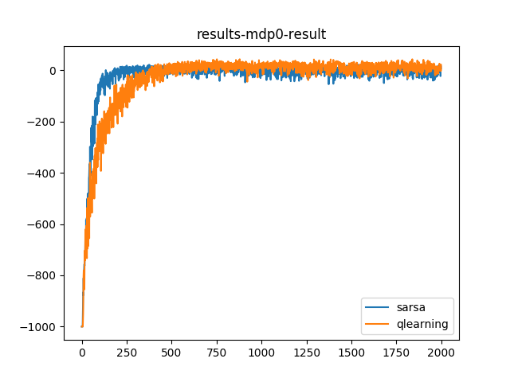

From the experiments carried out (explained further), optimal value of the lambda was found to be 0.8 for MDP instance 0. The optimal alpha was 0.8 and optimal epsilon was 0.2 for both the instances. The figure below shows the expected cumulative reward for gamma 1 vs the number of episodes for SARSA and Q Learning algorithms respectively on MDP instance 0.

#### Expected cumulative reward against episode number for Q-learning and Sarsa(λ=0.85) for MDP instance 1

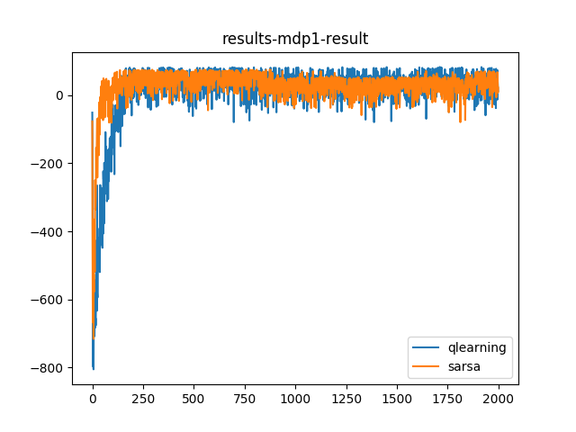

Likewise, optimal value of the lambda was found to be 0.85 for MDP instance 1. The optimal alpha was 0.8 and optimal epsilon was 0.2 for both the algorithms . The figure below shows the expected cumulative reward for gamma 1 vs the number of episodes for SARSA and Q Learning algorithms respectively on MDP instance 1.

#### Expected cumulative reward over the first 500 episodes of training for Sarsa(λ) against λ for MDP instance 0

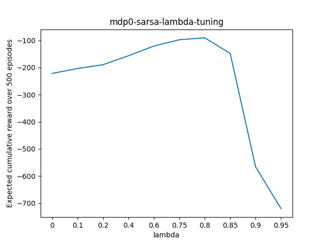

The procedure followed to tune the lambda value once alpha was fixed at 0.8 and epsilon was fixed at 0.2 was to plot the expected cumulative reward over first 500 episodes for SARSA on both the MDP instances. The figure below shows the variation expected cumulative reward as lambda is changed for MDP instance 0. The values of lambda used are more sparse as the likely distance from observed maxima goes increasing. The optimal value of lambda was found to be around 0.8 for MDP instance 0. This value is used in all the following experiments including the graph in section 1.

#### Expected cumulative reward over the first 500 episodes of training for Sarsa(λ) against λ for MDP instance 1

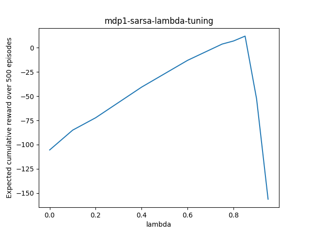

Similar procedure was followed for MDP 2 to find the optimal value of lambda as shown in figure below. The optimal value of lambda was found to be around 0.85 for MDP instance 1.

### Tuning

#### Tuning of epsilon for Q Learning on MDP instance 0

| 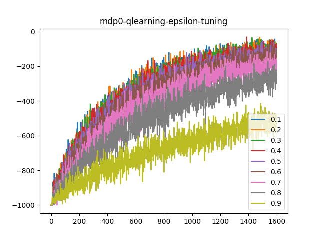 | 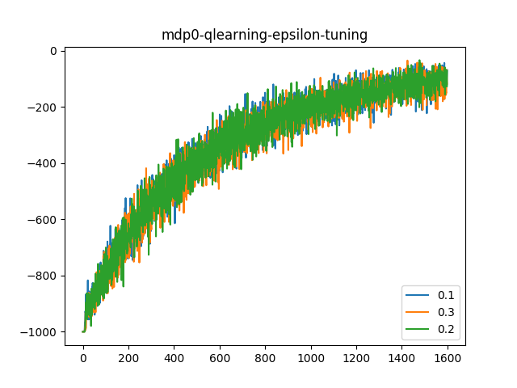 |
|:---:|:---:|
| Figure 1 | Figure 2 |

For tuning the epsilon, the alpha was set to 0.1. Then, the epsilon was varied from 0.1 to 0.9 in steps of 0.1. For each value of epsilon the expected cumulative reward was plotted against the episode number on the same axes for comparison.

But, due to noise, optimal epsilon is not clearly distinguishable. So, the the plots for suboptimal epsilons were removed. The plots for epsilons 0.1, 0.2 and 0.3 are nearly identical. Hence, individual plots for each epsilon (all the plots not included in the report are available on the link at the end of this report) were then checked to arrive at a moderate value of epsilon as 0.2.

#### Tuning of epsilon for Q Learning on MDP instance 1

| 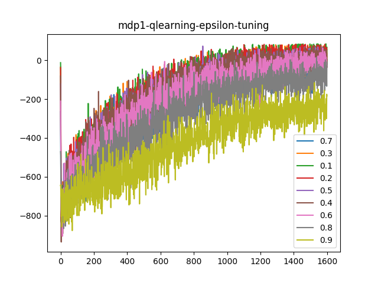 | 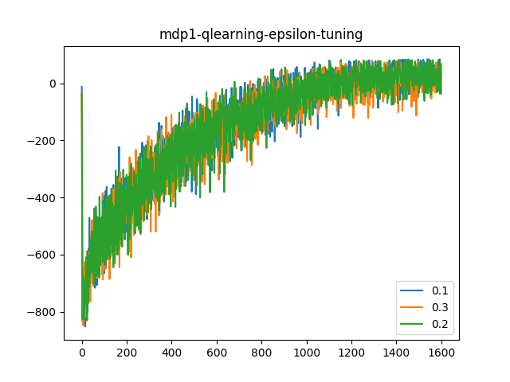 |
|:---:|:---:|
| Figure 3 | Figure 4 |

Same procedure as above was followed for rest of the experiments for tuning the epsilon across MDP instances 0 and 1. A suitable epsilon was found to be 0.2.

#### Tuning of epsilon for SARSA on MDP instance 0

| 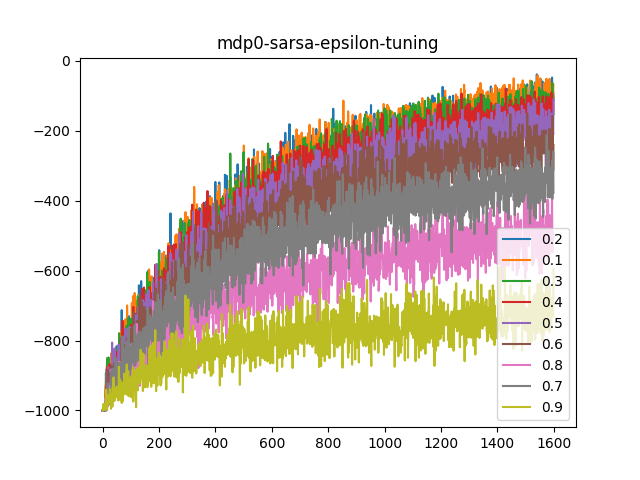 | 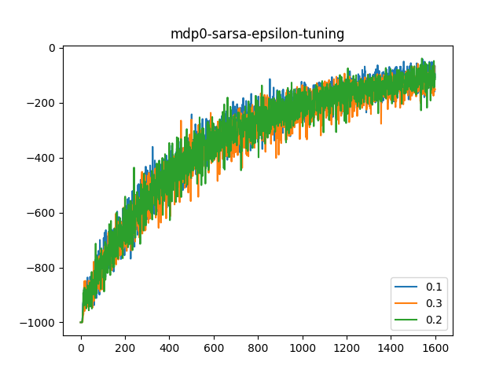 |
|:---:|:---:|
| Figure 5 | Figure 6 |

By applying the same hypothesis, while keeping alpha to be 0.1 and lambda 0, 0.2 was found out to be the suitable epsilon. The trace was kept as replace. This is compared with accumulating trace at the end.

#### Tuning of epsilon for SARSA on MDP instance 1

| 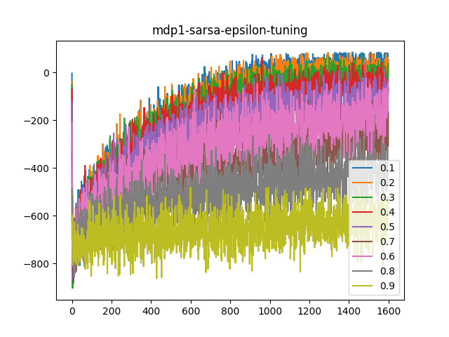 | 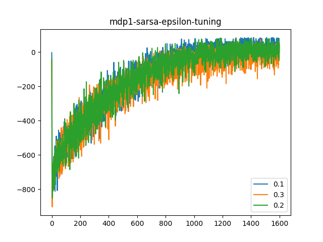 |
|:---:|:---:|
| Figure 7 | Figure 8|

Alpha was kept at 0.2, lambda was kept at 0 and trace set to replace, to get epsilon as 0.2 using the above described procedure.

Since, the optimal value of epsilon is not clearly distinguishable and lies around 0.2 in each case, this was set to be the default value of epsilon in client.py . All the tuned options hereafter are set as default in `client.py`.

#### Tuning of alpha for Q Learning on MDP instance 0

| 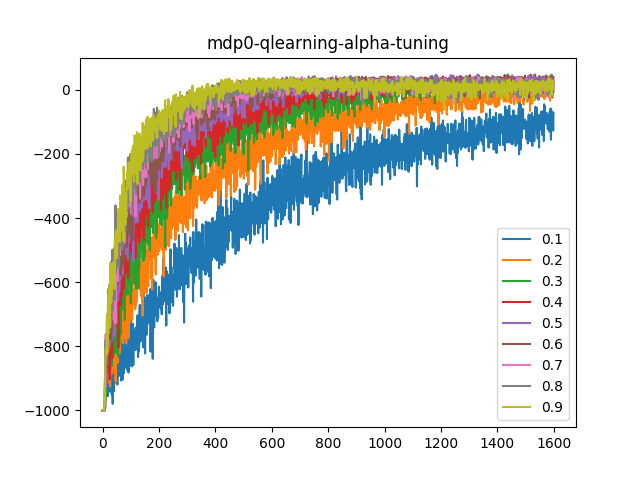 | 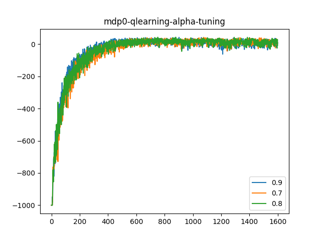 |
|:---:|:---:|
| Figure 9 | Figure 10 |
| 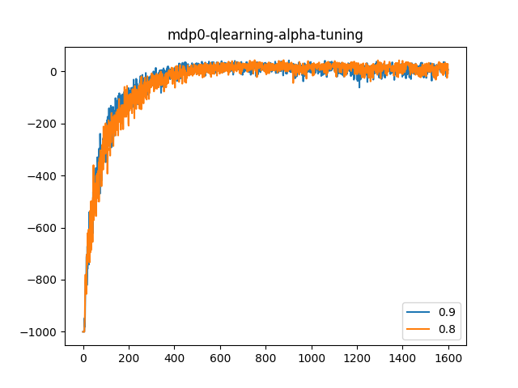 | |
|:---:|:---:|
| Figure 11 | |

For tuning the alpha, epsilon was set to the value found in previous section i.e. 0.2. The alpha was varied from 0.1 to 0.9 in steps of 0.1 and at each step the expected cumulative reward was plotted against the episode number on the same axes for the sake of comparison. To get a better idea of the trend of the alpha, plots for suboptimal values of alpha were removed and the remaining plots nearly coincided. The individual plots for each alpha (all the plots not included in the report are available on the link at the end of this report) were then checked to arrive at a suitable value of alpha as 0.8.

#### Tuning of alpha for Q Learning on MDP instance 1

|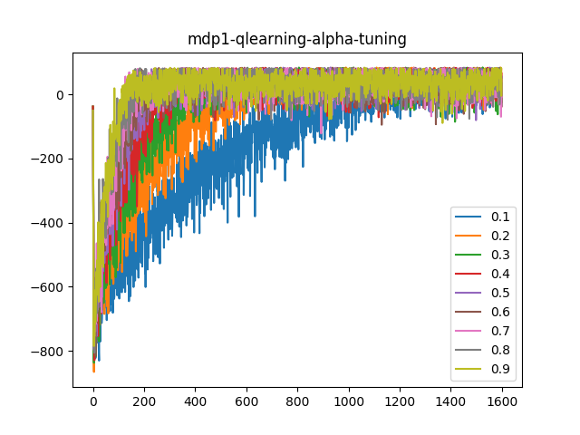 | 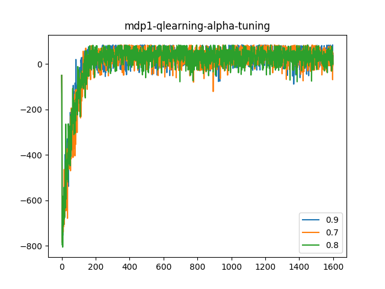 |
|:---:|:---:|
| Figure 12 | Figure 13 |
| 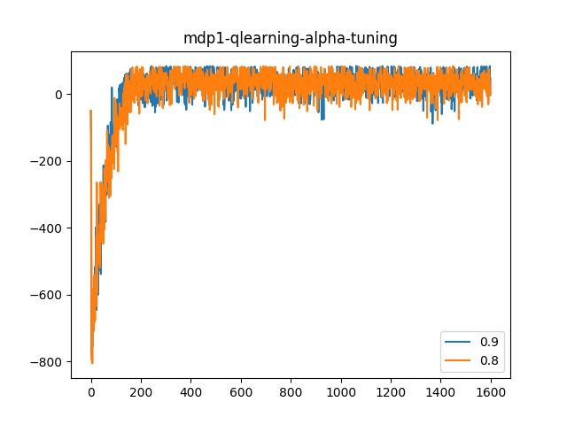 | |
|:---:|:---:|
| Figure 14 | |

The same procedure was followed for MDP instance 1 with epsilon 0.2 and alpha was chosen to be 0.8.

#### Tuning of alpha for SARSA on MDP instance 0

| 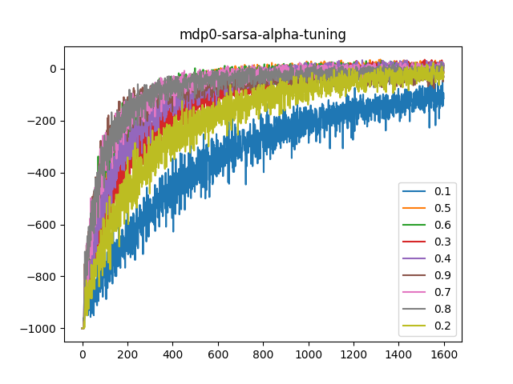 | 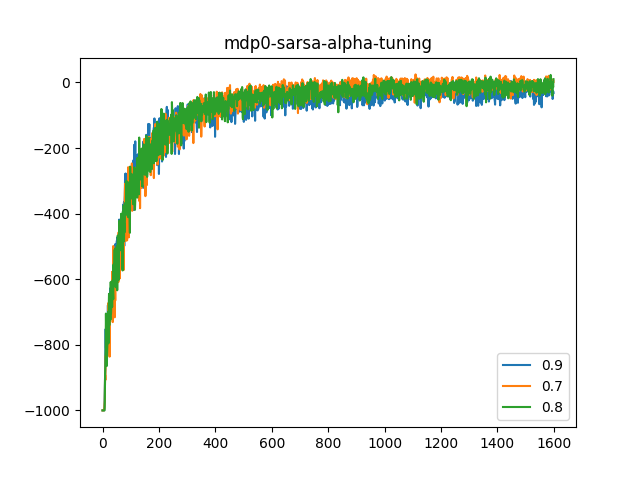 |
|:---:|:---:|
| Figure 15 | Figure 16 |

| 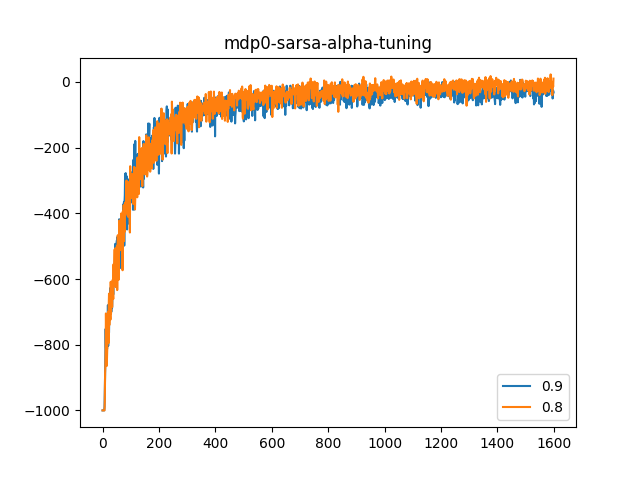 |
|:---:|
| Figure17 |

Similar procedure was applied for SARSA instances. Epsilon was kept to be 0.2, lambda to be 0 and the trace was defaulted to replace. The suitable value of alpha turned out to be 0.8

#### Tuning of alpha for SARSA on MDP instance 1

| 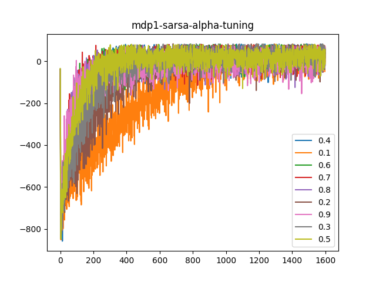 | 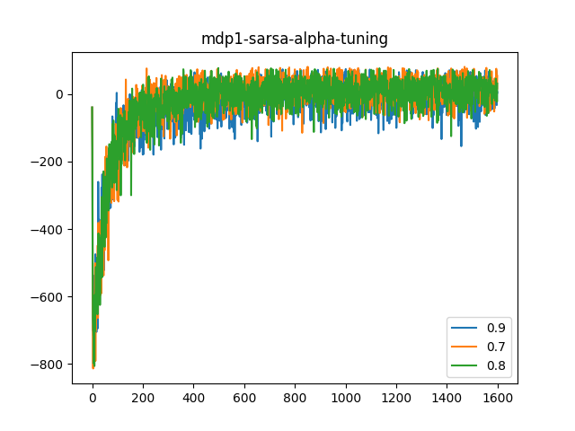 |
|:---:|:---:|
| Figure 18 | Figure 19 |

| 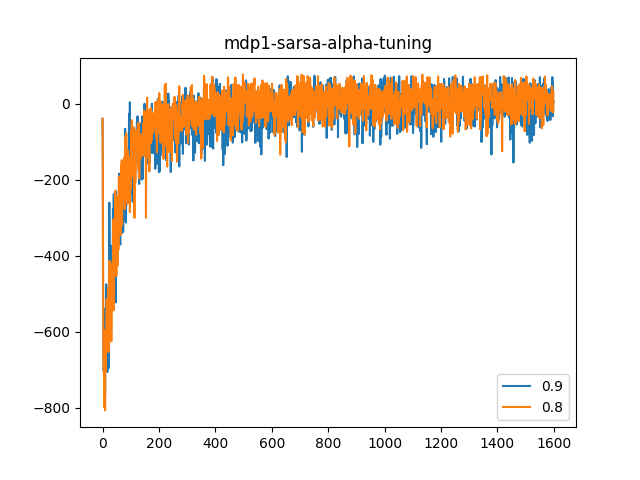|
|:---:|
| Figure 20 |

The same procedure with same parameters as above was applied here also to get alpha as 0.8.

#### Lambda tuning of SARSA on MDP instance 0

|  | 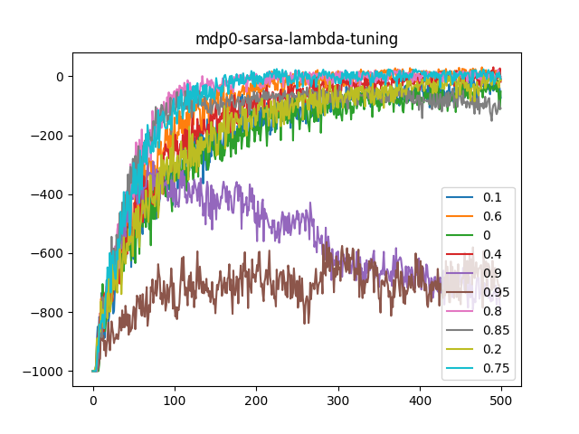 |
|:---:|:---:|
| Figure 21 | Figure 22 |

The lambda was tuned based on the requirement of the assignment to plot expected cumulative reward for first 500 episodes against lambda. To get more insight however, the trend of expected cumulative reward for the same 500 episodes was plotted against the episode number for each lambda and is shown in figure 22. The maximum expected cumulative reward for MDP instance 0 was found to be at lambda 0.8. This was selected as the optimal value of lambda.

#### Lambda tuning of SARSA on MDP instance 1

|  | 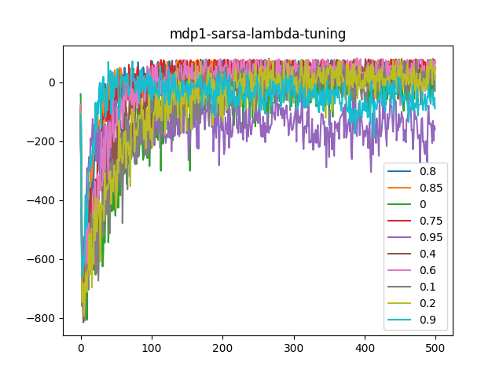 |
|:---:|:---:|
| Figure 23 | Figure 24 |

As in the section 5. A., here optimal value of lambda was found to be 0.85 from figure 23.

### Comparison

#### Comparison between variants of Q Learning on basis of annealing

An experiment was carried out to spot the effect of annealing of epsilon on the Q Learning algorithm. Figures 25 and 26 show the expected cumulative reward vs the episode number under annealing and in its absence for MDP instances 0 and 1 respectively. In MDP instance 0, Annealing improves the performance slightly but no such conclusion can be drawn from the MDP instance 1. Hence, annealing was not considered.

| 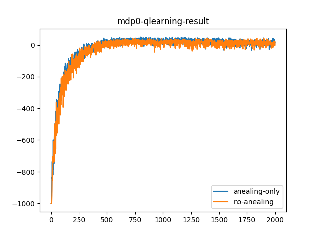 | 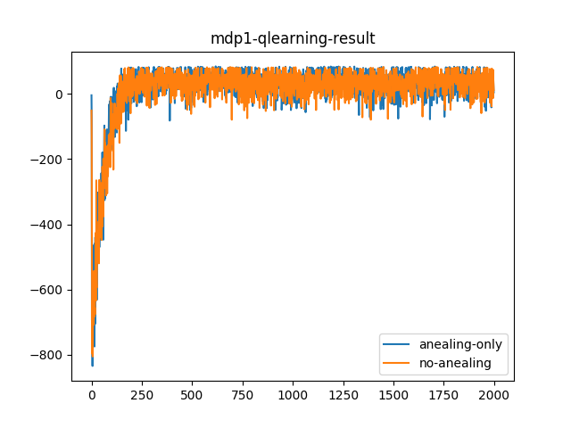 |
|:---:|:---:|
| Figure 25 | Figure 26 |

#### Comparison between variants of Comparison between variants of SARSA on basis of annealing and accumulating trace

Unlike above case, SARSA shows significant improvement when both annealing and
accumulating trace are used, but the improvement in the MDP instance 1 is not significant. Also, the no annealing no accumulating trace is in between the both the extremes. Since, this agent is to be tested on random instances of this MDP, the annealing and accumulating traces were not used.

| 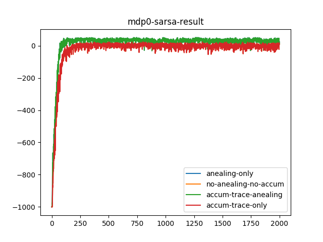 | 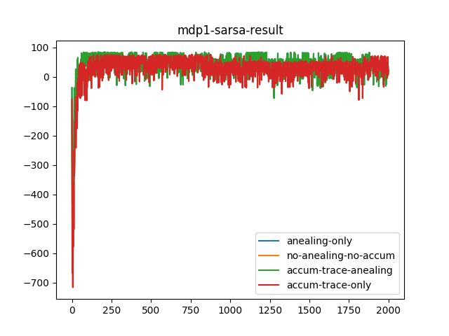 |
|:---:|:---:|
| Figure 27 | Figure 28 |

### Observations

- With proper tuning, SARSA(lambda) performs better than Q Learning for the same MDP. SARSA converges quickly than Q learning but leaves some margin for improvement w.r.t Q Learning in MDP instance 0.
- As lambda is increased, the expected cumulative reward increases upto a certain lambda, then it decreases even more as lambda approaches 1. This optimal lambda changes if the learning rate alpha changes.
- The noise in plots after 50 trials is more pronounced in MDP instance 1 which makes the tuning difficult. The number of trials for MDP 1, therefore should be more than 50.

### References

- [Sarsa(&lambda;): Section 7.5, Sutton and Barto (1998)](http://incompleteideas.net/sutton/book/ebook/node77.html).
**Note:** `e(s, a)` must be reset at the beginning of each episode.
- Q-learning: Section 6.5 (page 142), Sutton and Barto (2017) of Sutton & Barto 2017.