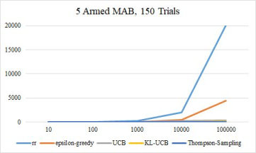
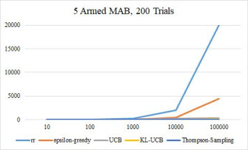
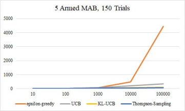
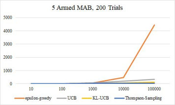
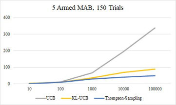
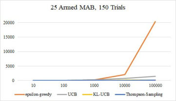
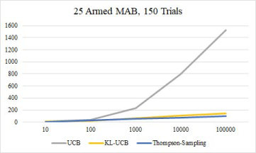
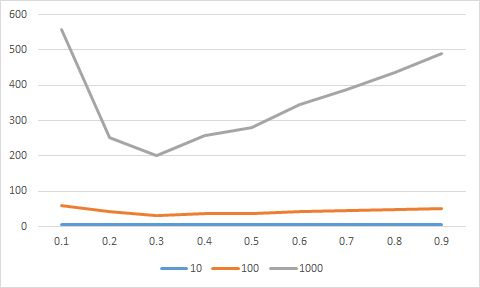

# Multi Armed Bandits

Download report [here](report/report.pdf)

In this repo, you will find the implemention and comparison of different algorithms for sampling the arms of a stochastic multi-armed bandit. Each arm provides i.i.d. rewards from a fixed Bernoulli distribution. The objective is to minimise regret. The algorithms implemented are epsilon-greedy exploration, UCB, KL-UCB, and Thompson Sampling.

### Enviornment Code

The server directory comprises the code to simulate a bandit, in other words, the `environment`. The server waits for a client (`agent`) to connect with it and start pulling arms in sequence. For each pull, the server generates a 0/1 reward based on the true mean of the arm pulled (known to the server, but unknown to the client), which is communicated back to the agent. Each communication from the server also contains the total number of pulls performed so far. Thus, each server message is of the form "reward, pulls". Agent-server communication happens through a TCP connection. The server is coded in `C++` and compiles into a binary called `bandit-environment` on running `make`. It can be started with a shell script called `startserver.sh`.

The `data` directory contains two bandit instances: one with 5 arms and another with 25 arms. Each instance is coded as a text file that lists the true means of the arms in sequence.

The client is the agent that implements sampling algorithms. The command line parameters to the client include `--algorithm` (which can take values epsilon-greedy, UCB, KL-UCB, and Thompson-Sampling (all case-sensitive)), and `--epsilon` (which will be a real number in [0, 1]). The agent is coded in `C++`: it compiles using `make` into a binary called `bandit-agent`.

Run `startexperiment.sh` in the top level directory to run an experiment. It will start the server and the client in sequence. The server writes out a log file based on its interaction with the client; the per-step reward and regret are available from this log file.

### Implementation Details

- Arm pulled in previous iteration was passed on to `SampleArm` function
- Index of largest element from array was found out using function `getIndexOfLargestElement` from [[3](#references)]

##### Epsilon-Greedy Algorithm

1. A random number was generated between 0 and 99. For the first pull, arrays were initialized with all zero values for keeping track of total reward, pulls done and empirical mean reward for each of the arm and an arm was selected randomly by using modulo operator according to number of arms on the previously generated random number.
2. For all next pulls, empirical mean was updated and if the random number generated was greater than epsilon times 100, the arm with maximum empirical mean was pulled. If this condition was not met, an arm was selected randomly as above.

##### UCB Algorithm

1. For the first pull, arrays were initialized with all zero values for keeping track of total reward, pulls done, empirical mean and a separate array to update empirical mean with `sqrt(2* Total Pulls/Pulls of Arm i)` for each of the arm.
2. These arrays were updated in all the subsequent pulls. If total pulls were less than number of arms then the arm was selected with index equal to total pulls, thus ensuring that each arm is pulled once.
3. Otherwise, arm with highest UCB term was pulled.

##### KL-UCB Algorithm

1. For the first pull, arrays were initialized with all zero values for keeping track of total reward, pulls done, empirical mean and qmax for each of the arm.
2. These arrays were updated in all the subsequent pulls. If total pulls were less than number of arms then the arm was selected with index equal to total pulls, thus ensuring that each arm is pulled once.
3. Otherwise, arm with highest qmax term was pulled.
4. qmax was found out by Newton Raphson method according to [[2](#references)].

##### Thompson Sampling

1. For the first pull, arrays were initialized with all zero values for keeping track of total reward, pulls done, empirical mean and random sample from beta distribution whose parameters change for each pull for each of the arm.
2. These arrays were updated in all the subsequent pulls. An arm with largest randomly drawn sample from beta distribution was pulled.
3. Beta distribution was generated using randist of GSL library.

### Plots

##### 5 Arm Instance

Following are the graphs of expected regret (Y axis) vs Number of Pulls (X axis) for 150 and 200 trials respectively for the 5 armed bandit.

 

From these graphs, it is evident that all the algorithms implemented viz. Epsilon-Greedy, UCB, KL-UCB and Thompson-Sampling outperform round robin sampling approach. But, comparison between remaining algorithms is not evident from these graphs. So, by removing the line corresponding to round robin and rescaling, following graphs were obtained.

 

Here, it can be observed that Epsilon-Greedy has cumulative regret of 4500 (less than quarter of that with round robin) in both the 150 trials and 200 trials cases. Also, the regret is roughly exponentially increasing with experiments with increasing number of pulls. UCB algorithm has 10 times less cumulative regret than Epsilon-Greedy.

 

Thompson-Sampling is the best performing algorithm and KL-UCB performed close to
it. It can be seen that regret goes on increasing more and more in the order Thompson-Sampling
with lowest regret, then KL-UCB, UCB and finally Epsilon-Greedy. Also, the regret does not
increase exponentially, graph bends more towards X axis between 10000 and 100000 pulls.
These are more observable in 25 armed case.

##### 25 Arm Instance

Trends similar to 5 armed bandit are observable in 25 armed counterpart. But, as the number of arms is more the regret is higher in all the algorithms.

 
 

 
 

There is a slight dip in KL-UCB than Thompson-Sampling for the experiment with 100 pulls which can also be confirmed from numerical results. However, the bending toward X-axis is only observable in 200 trials case.

### Results

##### 5 Armed Bandit 150 trials

Pulls | rr | epsilon-greedy | UCB | KL-UCB | Thompson-Sampling
------|----|----------------|-----|--------|------------------
10 | 1.9466 | 2.9066 | 1.2733 | 1.86 | 1.5466
100 | 19.9333 | 15.32 | 11.8533 | 10.0733 | 10.0266
1000 | 200.14 | 61.2333 | 66.3333 | 34.7466 | 28.7266
10000 | 2005.2133 | 462.8533 | 194.7733 | 67.92 | 40.2466
100000 | 20017.073 | 4433.84 | 338.4733 | 88 | 49.4733

##### 5 Armed Bandit 200 trials

Pulls | rr | epsilon-greedy | UCB | KL-UCB | Thompson-Sampling
------|----|----------------|-----|--------|------------------
10 | 2.015 | 2.435 | 1.43 | 1.965 | 1.715
100 | 19.835 | 13.875 | 11.68 | 10.665 | 10.26
1000 | 199.515 | 63.635 | 65.785 | 35.36 | 29.91
10000 | 1996.23 | 461.885 | 204.265 | 66.545 | 48.105
100000 | 20011.565 | 4429.835 | 331.055 | 115.825 | 40.03

##### 25 Armed Bandit 150 Trials

Pulls | rr | epsilon-greedy | UCB | KL-UCB | Thompson-Sampling
------|----|----------------|-----|--------|------------------
10 | 7.4866 | 5.7 | 7.4333 | 7.5133 | 4.6
100 | 51.2 | 41.9533 | 37.3866 | 22.8 | 24.9133
1000 | 506.6866 | 246.4866 | 235.22 | 64.22 | 50.88
10000 | 5082.1666 | 2088.6733 | 794.7 | 106.5133 | 72.14
100000 | 50842.8333 | 20429.6466 | 1529.6066 | 146.7066 | 95.4933

##### 25 Armed Bandit 200 Trials

Pulls | rr | epsilon-greedy | UCB | KL-UCB | Thompson-Sampling
------|----|----------------|-----|--------|------------------
10 | 7.47 | 5.66 | 7.41 | 7.41 | 4.525
100 | 50.445 | 40.91 | 37.5 | 22.72 | 24.66
1000 | 508.08 | 248.15 | 234.93 | 63.33 | 49.77
10000 | 5084.735 | 2089.485 | 788.545 | 107.54 | 69.43
100000 | 50835.245 | 20690.895 | 1524.815 | 141.695 | 86.03

### Observations

In 5 armed bandit, there is no dip of KL-UCB below Thompson-Sampling at 100 pulls, but regret values are comparable. In 25 armed counterpart, KL-UCB has slightly less regret (about 2). This is in agreement with Fig 2 of [[1](#references)], Kaufmann et. al. Following graph shows variation of expected regret (Y-axis) vs epsilon (X-axis) for Epsilon-Greedy Algorithm for different number of pulls over 150 instances.

The minimum regret for all the cases is around 0.3. Hence, this is the optimal value of epsilon.

Following graphs shows performance of algorithms in terms of expected reward at each pull over 2000 trials. Large number of trials are required to get smooth curves.

Here, the variations in UCB reward curve are unexpected. While the other algorithms perform exactly as expected. The dip of KL UCB near 100 pulls is due to better rewards than Thompson-Sampling during this period.

### References

1. Kaufmann, Emilie et al. “Thompson Sampling: An Asymptotically Optimal Finite-Time Analysis.” ALT (2012)
2. Junpei Komiyama’s Github [Library](https://github.com/jkomiyama/banditlib/blob/master/policy/policy_klucb.hpp)
3. Obeahon Okaiwele’s blog post “[C++: Get Index of Largest Element in Array](https://obtalk.wordpress.com/2013/02/27/c-get-index-of-largest-element-in-array/)”
4. Olivier Cappe, Aurelien Garivier “[The KL-UCB Algorithm for Bounded Stochastic Bandits and Beyond](https://perso.limsi.fr/cappe/Research/Talks/11-gatsby.pdf)”